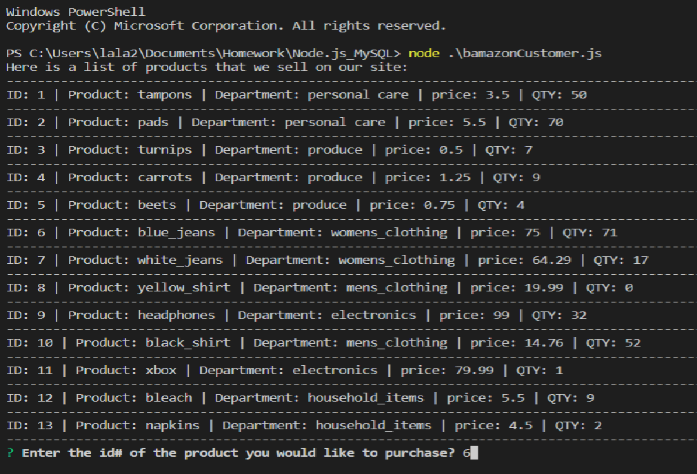
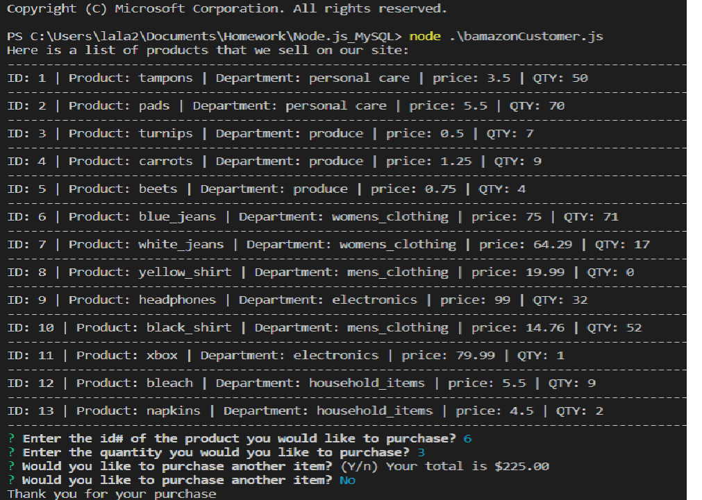
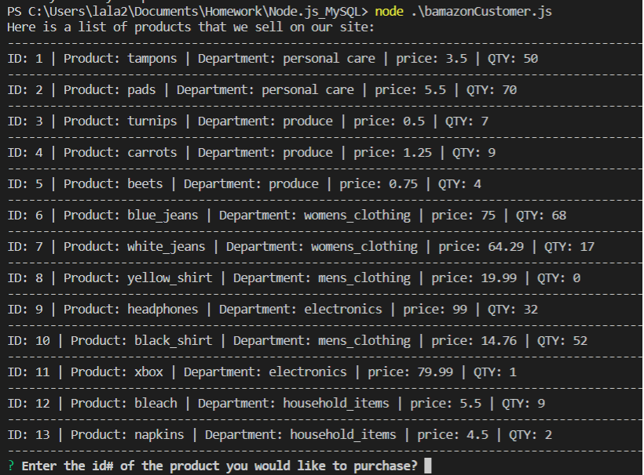

# Node.js_MySQL
### PennLPS Bootcamp Week #12 Assignment

An Amazon-like storefront powered by Node.js and MySQL.

### HOW IT WORKS

The bamazonCustomer.js file will first display all of the items sold at Bamazon along with their product ids, names, price and stock quantity.

The app will then prompt users with two messages: 
* Enter the ID # of the product that they would like to purchase.
* Enter the quantity they would like to buy for the chosen item.
Once the customer has placed the order, the application will check if the store has sufficient product items to meet the customer's request.

In the example product id #6 is being purchased.

 

If there isn't enough inventory on hand for the user's selection, they will alerted that the quantity is unavailabe and will be prompted to order a different item. If there is enough inventory on hand, the order will go through and the user will be asked if they would like to order again. Note that the quantity of item #6 has also been decreased.

### Resources
* Node.js
* MySQL
* JavaScript
* MySQLWorkbench
* Terminal/Gitbash

##### NPMs
* [Inquirer] (https://www.npmjs.com/package/inquirer)
* [MySQL] (https://www.npmjs.com/package/mysql) 
